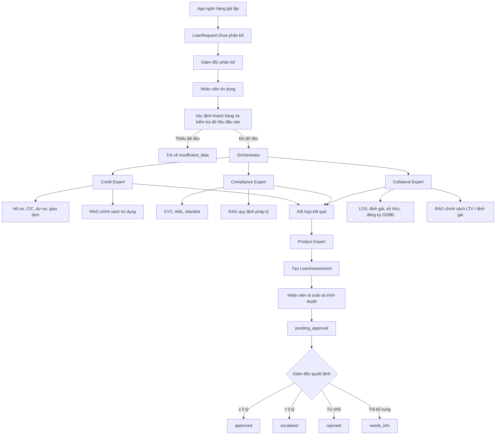

# AUCO AI — Kiến trúc tập trung đánh giá yêu cầu khoản vay

## 1. Một việc duy nhất

AUCO AI chỉ làm một việc:

> Nhận yêu cầu vay của một khách hàng, thu thập dữ liệu cần thiết, phối hợp các chuyên gia để đánh giá và trả về gợi ý có căn cứ cho nhân viên ngân hàng.

Hệ thống là công cụ hỗ trợ nhân viên ra quyết định. Hệ thống không tự phê duyệt khoản vay và không tự giải ngân.

## 2. Người dùng và đầu vào

Người dùng trực tiếp là nhân viên tín dụng.

Yêu cầu vay không bắt đầu bằng chat. Yêu cầu được giả lập nhận từ API của ứng dụng ngân hàng và lưu thành một `LoanRequest`.

```text
App ngân hàng → LoanRequest chưa phân bổ
             → Giám đốc phân cho nhân viên tín dụng
             → Nhân viên kiểm tra hồ sơ và bấm Đánh giá
             → Orchestrator tạo LoanAssessment (gợi ý)
             → Nhân viên chọn nhãn kết luận + ghi ý kiến + trình duyệt
             → Giám đốc phê duyệt / từ chối / trả bổ sung
             → (nếu > 5 tỷ VND) chuyển escalated lên cấp trên
```

Mỗi yêu cầu đánh giá cần tối thiểu:

- Nhân viên đang thực hiện tra cứu.
- Mã khách hàng hoặc thông tin đủ để xác định khách hàng.
- Số tiền muốn vay.
- Mục đích vay.

Dữ liệu bổ sung được lấy từ hệ thống hoặc dữ liệu mô phỏng:

- Hồ sơ và danh mục khách hàng.
- Thu nhập, vốn tự có và tài sản bảo đảm.
- CIC, nhóm nợ và dư nợ tại tổ chức tín dụng khác.
- Lịch sử giao dịch và các khoản vay hiện tại.
- Kết quả KYC, AML và cảnh báo danh sách đen.
- Quy định pháp luật và chính sách tín dụng đang có hiệu lực.
- Danh mục sản phẩm vay của ngân hàng.

Nếu thiếu dữ liệu quan trọng, hệ thống phải trả về `insufficient_data` và nêu rõ cần bổ sung gì; không được tự suy đoán.

### UX chạy đánh giá

Nhân viên không phải nhập câu chat “đánh giá khách hàng A”. Từ hồ sơ đã được giao, nút **Chạy đánh giá** tự động:

1. Ghép prompt nghiệp vụ chuẩn từ khách hàng, số tiền, kỳ hạn, mục đích và TSĐB.
2. Tạo `TaskRun` và chạy `Credit ‖ Legal/Compliance ‖ Collateral → Product`.
3. Tự gửi prompt vào panel **Trợ lý AI** và hiển thị tiến trình từng Expert ngay trong hội thoại.
4. AI đề xuất một `assessmentTag`; nhân viên xác nhận hoặc đổi nhãn ngay trong hội thoại.
5. Nhân viên có thể ghi ý kiến và trình Giám đốc ngay tại điểm chạm này, không phải tìm lại card hồ sơ.

Panel **Trợ lý AI** là điểm tương tác AI duy nhất: nhận luồng đánh giá từ nút nghiệp vụ, tra cứu văn bản và trả lời câu hỏi làm rõ. Nút trên `LoanRequest` chỉ kích hoạt đúng workflow/prompt chuẩn; không tạo một UI AI thứ hai.

### Vòng đời LoanRequest

```text
unassigned → assigned → assessing → advised
                              ├──→ failed
                              └──→ pending_approval
                                         ├──→ approved          (≤ 5 tỷ VND)
                                         ├──→ escalated         (> 5 tỷ VND)
                                         ├──→ rejected
                                         └──→ needs_info → (bổ sung) → pending_approval
```

- `unassigned`: yêu cầu mới từ app ngân hàng, chưa có người xử lý.
- `assigned`: giám đốc đã giao cho một nhân viên tín dụng.
- `assessing`: nhân viên đã bắt đầu chạy đánh giá AI.
- `advised`: đã có gợi ý `LoanAssessment`; nhân viên phải chọn `assessmentTag` và ghi ý kiến trước khi trình duyệt.
- `pending_approval`: nhân viên đã trình; chờ giám đốc quyết định.
- `approved`: giám đốc phê duyệt trong hạn mức chi nhánh (demo ≤ 5 tỷ VND).
- `escalated`: vượt hạn mức chi nhánh; chuyển cấp phê duyệt cao hơn (chưa có UI hội đồng).
- `rejected`: giám đốc từ chối.
- `needs_info`: giám đốc trả hồ sơ để bổ sung; nhân viên có thể chạy lại đánh giá rồi trình lại.
- `failed`: đánh giá lỗi kỹ thuật và có thể chạy lại sau.

`assessmentTag` là kết luận nghiệp vụ do nhân viên chịu trách nhiệm, không phải tag AI tự ghi: `recommend_approve`, `manual_review`, `needs_documents` hoặc `recommend_reject`. Danh sách hồ sơ có thể lọc theo nhãn này.

Giám đốc thấy các yêu cầu thuộc chi nhánh: phân bổ và phê duyệt. Nhân viên chỉ thấy hồ sơ được giao: đánh giá AI, gắn nhãn và trình duyệt. Nhân viên không tự phê duyệt khoản vay. AI không có quyền quyết định.

## 3. Kết quả duy nhất

Hệ thống trả về một `LoanAssessment` cho nhân viên:

```text
LoanAssessment {
  customer
  request
  creditAssessment
  complianceAssessment
  collateralAssessment
  productSuggestion
  recommendation
  reasons[]
  risks[]
  missingData[]
  nextActions[]
  citations[]
}
```

`recommendation` chỉ có các giá trị:

- `proceed_with_conditions`: có thể tiếp tục xử lý với các điều kiện kèm theo.
- `manual_review`: cần người có thẩm quyền kiểm tra.
- `do_not_proceed`: không nên tiếp tục dựa trên dữ liệu hiện có.
- `insufficient_data`: chưa đủ dữ liệu để đưa ra gợi ý.

Đây là gợi ý nghiệp vụ, không phải quyết định phê duyệt chính thức.

## 4. Luồng xử lý



Credit, Compliance và Collateral chạy song song vì sử dụng các nguồn dữ liệu độc lập. Product chỉ chạy sau khi ba đánh giá trên hoàn tất. Ops không nằm trong pipeline thẩm định; chỉ liên quan vận hành sau phê duyệt. Sau `advised`, quyết định chính thức thuộc thẩm quyền con người (maker–checker).

## 5. Trách nhiệm của từng thành phần

### LoanRequest Queue

- Nhận form yêu cầu vay từ API giả lập của app ngân hàng.
- Hiển thị card theo trạng thái, khách hàng, số tiền và mục đích vay.
- Cho giám đốc phân bổ hồ sơ cho nhân viên tín dụng.
- Chỉ cho nhân viên được giao bắt đầu đánh giá và trình duyệt.
- Cho giám đốc phê duyệt / từ chối / trả bổ sung trên hồ sơ `pending_approval`.
- Hạn mức chi nhánh demo: 5 tỷ VND; vượt hạn mức → `escalated`.
- Mỗi `LoanRequest` chỉ có một lần đánh giá đang gắn tại một thời điểm; có thể chạy lại sau `needs_info`.

### Orchestrator

- Nhận một yêu cầu đánh giá khoản vay.
- Kiểm tra dữ liệu đầu vào.
- Giao đúng nhiệm vụ cho từng Expert.
- Chờ các đánh giá cần thiết hoàn thành.
- Tổng hợp thành đúng một `LoanAssessment`.
- Không tự tạo kết luận nghiệp vụ nếu Expert không cung cấp bằng chứng.

### Credit Expert

Trả lời các câu hỏi:

- Khách hàng có lịch sử tín dụng như thế nào?
- Đang có khoản vay hoặc dư nợ tại tổ chức tín dụng khác không?
- Thu nhập, dòng tiền và vốn tự có có phù hợp không?
- Số tiền yêu cầu có vượt hạn mức đề xuất không?
- Có vi phạm DTI, LTV hoặc chính sách tín dụng không?

Nguồn dữ liệu:

- CIC hoặc dữ liệu CIC mô phỏng.
- Core banking và LOS.
- Hồ sơ khách hàng.
- RAG chính sách tín dụng.

### Compliance Expert

Trả lời các câu hỏi:

- KYC đã đầy đủ chưa?
- Có tín hiệu AML, gian lận hoặc danh sách đen không?
- Hồ sơ có vi phạm quy định đang có hiệu lực không?
- Có điểm nào bắt buộc nhân viên kiểm tra thủ công không?

Compliance Expert chỉ đưa ra mức rủi ro và cảnh báo. Expert không được khẳng định một khách hàng “rửa tiền” nếu không có kết luận từ cơ quan hoặc quy trình có thẩm quyền.

Nguồn dữ liệu:

- Hệ thống compliance hoặc dữ liệu AML mô phỏng.
- Blacklist/sanctions/PEP khi có.
- RAG văn bản pháp luật và quy định nội bộ.

### Collateral Expert

- Tra cứu hồ sơ tài sản bảo đảm từ LOS.
- Tính LTV thực tế bằng số tiền vay / giá trị định giá hợp lệ gần nhất.
- Kiểm tra quyền sở hữu, trạng thái đăng ký giao dịch bảo đảm và độ mới của định giá.
- Đối chiếu chính sách LTV, chu kỳ định giá lại từ RAG `collateral`.
- Trả `acceptable`, `needs_info` hoặc `not_applicable` đối với khoản tín chấp.
- Không đánh giá CIC, AML hay tự quyết định phê duyệt khoản vay.

Nguồn dữ liệu:

- LOS: loại/mô tả TSĐB, giá trị/ngày/đơn vị định giá, quyền sở hữu, đăng ký GDBĐ.
- RAG `collateral`: ngưỡng LTV, checklist pháp lý và tần suất định giá lại.

### Product Expert

- Chỉ chạy khi đã có kết quả Credit và Compliance.
- Lọc các sản phẩm phù hợp với mục đích vay, hạn mức và mức rủi ro.
- Đề xuất một sản phẩm chính và các điều kiện đi kèm.
- Không thay Credit quyết định khả năng vay.

## 6. RAG và dữ liệu

Expert không được “nhớ” chính sách ngân hàng bằng trọng số model. Các kết luận về chính sách phải lấy từ RAG và có citation.

### Nguồn tri thức chuẩn hóa

Tri thức không do chi nhánh soạn hay duyệt trong app. Nguồn chuẩn hóa là **API riêng của ngân hàng** (hội sở / khối chính sách). Trong demo bài thi, API và quy trình nội bộ được giả lập bằng file JSON; đây không phải văn bản thật của SHB:

```text
GET /api/bank-hq/knowledge
  ← đọc backend/data/mock/bank-hq-knowledge.json

POST /api/knowledge/documents/sync
  → upsert KnowledgeDocument từ HQ
  → re-index KnowledgeChunk (RAG)
```

Nhân viên và giám đốc chỉ:

- Đồng bộ tri thức từ API hội sở về app.
- Tra cứu thư viện (tab Tri thức) hoặc hỏi Trợ lý AI để lấy trích dẫn.

Họ không tạo, sửa hay xuất bản văn bản chuẩn hóa trong app.

### Bộ tri thức demo

`bank-hq-knowledge.json` gồm 39 tài liệu thuộc 5 domain. Quy trình nội bộ (`shb-hq://`) là dữ liệu giả lập có số hiệu, ngày hiệu lực và phiên bản để minh họa tư duy quản trị tri thức. Bảy tài liệu có URL công khai là **nội dung thật crawl từ nguồn public**: Thông tư 39/2016/TT-NHNN (điều kiện vay, thẩm định, lãi suất quá hạn), Thông tư 11/2021/TT-NHNN (5 nhóm nợ), Luật 14/2022/QH15 về Phòng chống rửa tiền (KYC, dấu hiệu đáng ngờ), Nghị định 21/2021/NĐ-CP (tài sản bảo đảm, hiệu lực đối kháng) và ba trang sản phẩm công khai của SHB (vay mua nhà, vay xây sửa nhà, vay tiêu dùng tín chấp).

Bộ dữ liệu giả phải nhất quán với logic nghiệp vụ đang demo: DTI 60%, hạn mức chi nhánh 5 tỷ VND, LTV nhà ở 70%, nhà xưởng 75%, ô tô mới 80% và trần tín chấp 500 triệu VND. Kịch bản trình diễn nằm tại `DEMO_RAG.md`.

Tài liệu RAG cần có:

- Domain: `credit`, `legal`, `collateral`, `product` hoặc `ops`.
- Trạng thái hiệu lực.
- Ngày hiệu lực và ngày hết hiệu lực.
- Quan hệ sửa đổi/thay thế tài liệu cũ.
- Nguồn và nội dung có thể trích dẫn.

Chỉ tài liệu `active` được dùng mặc định. Tài liệu `superseded` chỉ dùng để giải thích lịch sử thay đổi.

## 7. Human-in-the-loop

Đánh giá AI chỉ đọc và gợi ý: TaskRun luôn chạy với chế độ không side-effect, không còn generic `waiting_approval` trên TaskStep, không còn WebSocket approval.

HITL chính thức là maker–checker trên `LoanRequest`:

1. Nhân viên xem nhận định AI, chọn/xác nhận `assessmentTag`, ghi ý kiến.
2. Nhân viên trình Giám đốc (`pending_approval`).
3. Giám đốc phê duyệt / từ chối / trả bổ sung; vượt 5 tỷ VND → `escalated`.

## 7.1 Public API One Job

Giữ:

- `/health`
- `/api/actors`
- `/api/loan-requests/**`
- `POST /api/task-runs`, `GET /api/task-runs/:id`
- `/api/knowledge/documents` (list/get/sync)
- `GET /api/bank-hq/knowledge`

Đã loại khỏi sản phẩm:

- Automations, Compare, generic Approvals, WebSocket realtime
- Public `/api/rag/*`, `/api/mcp/*`, `/api/llm/*`, `/api/audit`
- Knowledge authoring / curator ingest proposals

MCP, RAG, LLM và Audit vẫn chạy nội bộ cho Expert và sync HQ.

## 8. Ngoài phạm vi

Phiên bản này không làm:

- Tự động phê duyệt khoản vay.
- Soạn hợp đồng.
- Mở tài khoản vay.
- Đẩy lệnh giải ngân.
- Quản lý ticket vận hành.
- Automation báo cáo định kỳ.
- Agent Studio hoặc cho người dùng tự cấu hình Expert.
- Kết nối thật tới CIC hoặc hệ thống của ngân hàng khác khi chưa có API.
- Fine-tune một model riêng cho từng Expert.

Những phần này không được đưa vào luồng chính cho đến khi việc đánh giá khoản vay hoạt động đúng và đo được chất lượng.

## 9. Nguyên tắc triển khai

1. Một `LoanRequest` tạo tối đa một assessment trong MVP.
2. Mỗi kết luận phải chỉ ra dữ liệu hoặc tài liệu làm căn cứ.
3. Thiếu dữ liệu phải nói thiếu, không bịa.
4. Credit, Compliance và Collateral độc lập, chạy song song.
5. Product phụ thuộc kết quả Credit, Compliance và Collateral.
6. Model không được gọi tool ngoài quyền của Expert.
7. Không thực hiện side-effect trong luồng đánh giá.
8. Ưu tiên luồng cố định, dễ test trước khi dùng Planner động.

## 10. Thứ tự xây dựng

Chúng ta triển khai từng bước:

1. Chuẩn hóa input và output `LoanAssessment`.
2. Hoàn thiện Credit Expert bằng dữ liệu khách hàng, CIC và chính sách tín dụng.
3. Hoàn thiện Compliance Expert bằng KYC, AML và quy định.
4. Hoàn thiện Collateral Expert bằng dữ liệu TSĐB, LTV và RAG định giá.
5. Kết hợp ba kết quả và xử lý thiếu dữ liệu/xung đột.
6. Thêm Product Expert để đưa gợi ý sản phẩm.
7. Nối giao diện và hiển thị lý do, rủi ro, citation.
8. Chỉ sau khi luồng trên ổn định mới cân nhắc hành động vận hành.

## 11. Tiêu chí hoàn thành đầu tiên

Với một khách hàng seed và một yêu cầu vay, hệ thống phải:

- Xác định đúng khách hàng.
- Lấy được dữ liệu CIC và hồ sơ tài chính.
- Trả đánh giá Credit có lý do.
- Trả đánh giá Compliance có cảnh báo và citation.
- Đề xuất sản phẩm phù hợp.
- Trả một `LoanAssessment` dễ hiểu cho nhân viên.
- Không tạo hồ sơ LOS, hợp đồng hoặc lệnh giải ngân.

